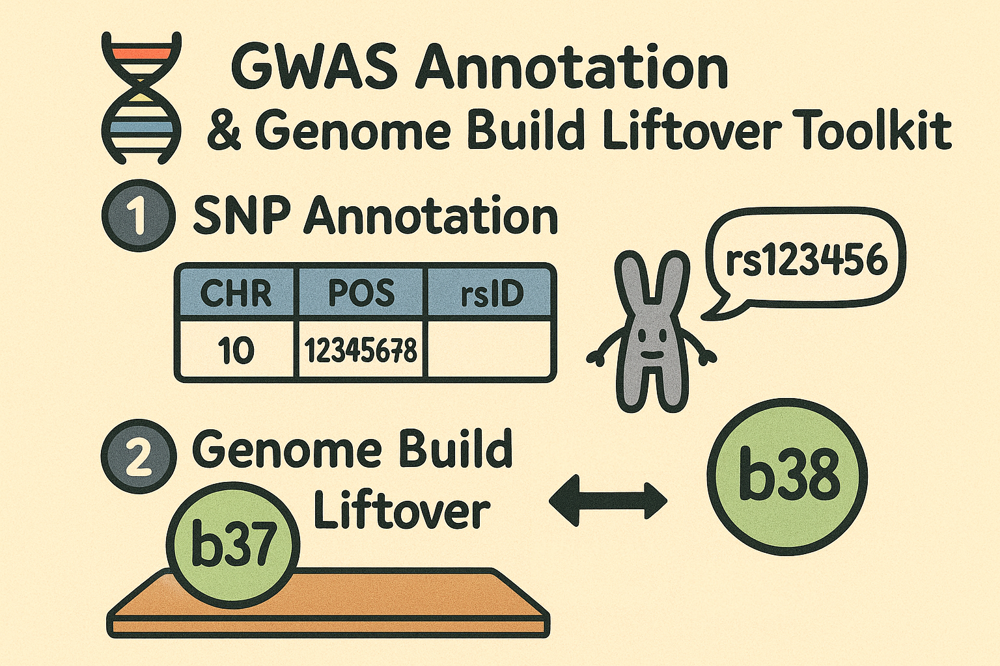

# GWAS rsID annotation and LiftOver



## Summary

This repository contains workflow / scripts for:
 
(1) annotating GWAS with rsIDs (e.g. in regenie output, when only CHR and GENPOS columns are present)

(2) performing liftover of genome build (38 <--> 37)

Annotation and liftover can be done as a part of one workflow or completely independently. 

## Workflow

*Please note:*

- remember to make all `.sh` files executable (`chmod 777 file.sh`)
- it is recommended to do this on a server, as it might be very slow in a local environment

### Obtaining genome reference data

Both datasets will be downloaded into `refdata/` folder in the working directory (i.e. this cloned repo).


**Please note:** if you are in **Exeter**, the data download step can be skipped - simply create a symbolic link to data in `/slade/projects/Public_Ref_Datasets/dbsnp/annotate_rsids_and_liftover/refdata/` (`ln -s`)


#### Data for rsID annotation

Download dbSNP v157 data in VCF format (for the specified genome build 37/38), and subset it to only required for annotation columns in .txt format.

*To run:* (recommended to run with `nohup` or `screen` as it might take a while)

```
./00_download_ref_data_annotation.sh 38 # specify build 38 or 37
```
 
*Output:*
`refdata/dbSNP157_refdata_build38.txt`

#### Data for LiftOver

Download the chain files required for performing liftover; must specify the starting genome build (38 or 37). 

*To run:*

```
./00_download_ref_data_liftover.sh 38 # specify build 38 or 37
```

*Output:*
`refdata/hg38ToHg19.over.chain` or `refdata/hg19ToHg38.over.chain`

### (1) Genome annotation

Script for performing rsID annotation; The main `.sh` script internally calls `.R` script:

```
├── 01_annotate_GWAS_with_rsids.sh
    └── 01_annotate_helper.R
```

_Assumptions:_

- The input GWAS file is in the regenie format (i.e. the specific column order and names; modify those in your file before running the script if needed):
`CHROM GENPOS ID ALLELE0 ALLELE1 A1FREQ INFO N TEST BETA SE CHISQ LOG10P EXTRA`
- The input GWAS file name does not contain dots in the file name; only to separate the file extension:
	- `my_GWAS.txt.gz` - ok
	- `my.GWAS.txt.gz` - not ok

- If running on a server, make sure to load the necessary R modules: (e.g. for Exeter, uncomment line 42 in `01_annotate_GWAS_with_rsids.sh`)

- The script uses the dbSNP annotation data (`refdata/dbSNP151_refdata_build38.txt`) generated earlier using `00_download_ref_data_annotation.sh`, so it assumes that the input GWAS data is in build 38.

*To run:*

Provide __full paths__ to annotaion file and input GWAS file:

```
./01_annotate_GWAS_with_rsids.sh /path/to/refdata/dbSNP157_refdata_build38.txt /path/to/your/GWAS.txt.gz
```

*Output:* `/path/to/your/GWAS_rsids.txt.gz`


### (2) Genome liftover

Script for performing liftover; The main `.sh` script internally calls `.R` script:

```
├── 02_liftover_GWAS.sh
    └── 02_lifover_helper.R
```

_Assumptions:_

- The same assumptions as for (1) apply here; 
- If running on a server, make sure you load the necessary R module: (e.g. for Exeter, uncomment line 22 in `02_liftover_GWAS.sh `)

*To run:*

Provide __full paths__ to input GWAS file (output from (1) or a separate file in regenie format), path to folder containing the downloaded chain files, and the _starting_ genome build (i.e. if need b38 -> b37, add '38'):

```
./02_liftover_GWAS.sh /path/to/your/GWAS_rsids.txt.gz /path/to/refdata/ 38
```

*Output:* `/path/to/your/GWAS_rsids_b37.txt.gz`


